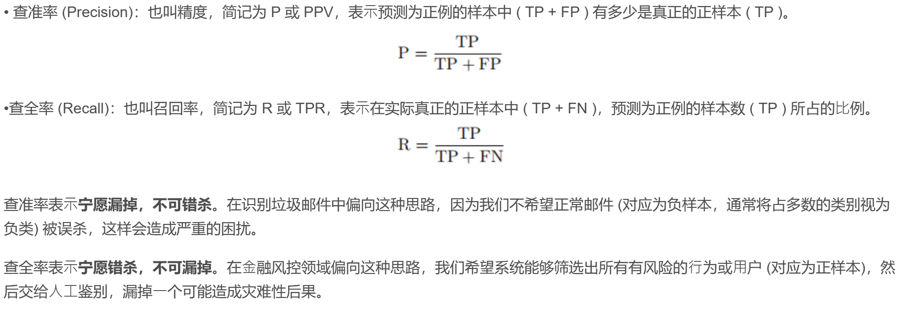
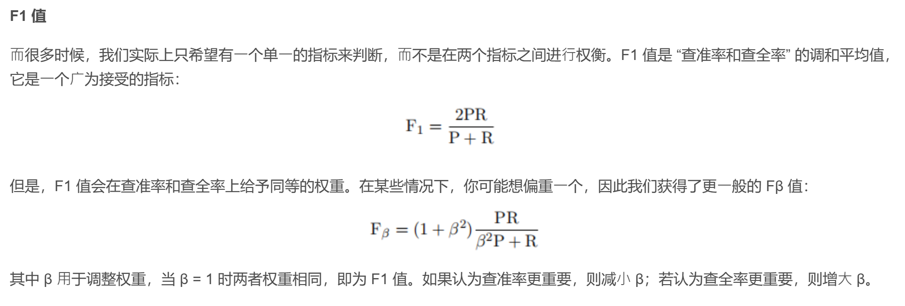

# 模型评估与选择

## 经验误差与过拟合

假设在$m$个样本中有$a$个样本分类错误，则错误率$E=a/m$。相应的，$1-a/m$被称为精度。

机器学习的问题通常是$NP$完全甚至更难，而有效的学习算法必然是在多项式时间内运行完成。

因此，只要相信$P \ne NP$，过拟合就不可避免。

**$ROC$与$AUC$**是检验评估机器学习算法的两种重要曲线

## 损失函数

每一种机器学习算法都需要有一个或多个损失函数，我们的机器学习的目标就是将这个损失函数的损失降至最低。